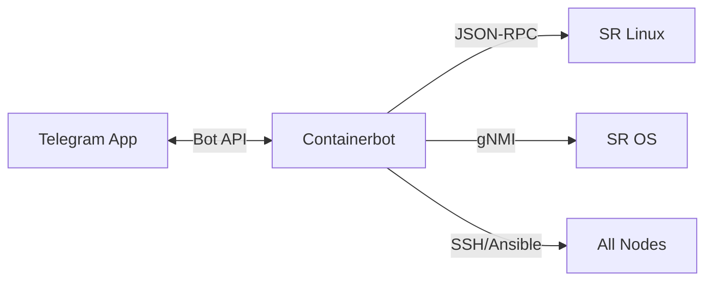

# Containerbot

## Descripción

**Containerbot** es un bot de Telegram diseñado para ejecutar scripts de operación y pruebas contra los equipos del laboratorio. Permite controlar el laboratorio remotamente desde un chat de Telegram, ejecutando scripts de shell y Python que interactúan con los equipos Nokia via JSON-RPC y gNMI.

## Funcionalidades

- **Auto-discovery de scripts**: Escanea automáticamente el directorio `scripts/` y genera botones de ejecución
- **Categorización**: Los scripts se organizan en categorías (Link Failures, Verification, General)
- **Confirmación**: Algunos scripts requieren confirmación antes de ejecutarse
- **Arguments**: Algunos scripts aceptan argumentos dinámicos
- **Ansible Playbooks**: Soporte para ejecutar playbooks de Ansible
- **Timeouts**: Timeout configurable por script (default: 120s)
- **Message Limits**: Trunca output largo para no exceder el límite de Telegram

## Arquitectura

