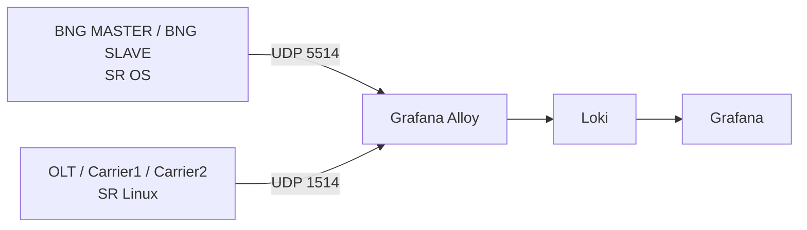

# LOGs

La sección **LOGs** documenta la integración de syslog del laboratorio y el dashboard de Grafana que centraliza los eventos de los equipos Nokia.

## Objetivo

Esta integración se diseñó para cubrir tres necesidades del laboratorio:

1. Centralizar eventos de `SR OS` y `SR Linux` en un solo pipeline.
2. Poder filtrar rápidamente por plataforma, equipo, aplicación y tipo de evento.
3. Mantener una arquitectura simple que reutiliza `Grafana`, ya presente en el lab.

## Componentes

| Componente | Función |
|-----------|---------|
| `Loki` | Almacena e indexa los logs |
| `Alloy` | Recibe syslog, normaliza etiquetas y envía a Loki |
| `Grafana` | Visualiza los logs y expone el dashboard |

## Qué documenta este módulo

En esta sección vas a encontrar:

- la arquitectura completa del pipeline de logs
- el detalle de cada bloque de `configs/logs/config.alloy`
- el detalle de cada bloque de `configs/logs/loki-config.yml`
- la configuración de syslog aplicada en `SR OS` y `SR Linux`
- el impacto de la retención y cómo funciona el almacenamiento efímero por defecto
- consultas útiles y validaciones operativas

## Acceso

| Servicio | URL | Credenciales |
|---------|-----|--------------|
| Grafana | `http://localhost:3030` | `admin/admin` |
| Loki API | `http://localhost:3101` | N/A |
| Alloy UI | `http://localhost:12345` | N/A |

## Flujo general

## Qué incluye el dashboard

El dashboard `Nokia Syslog Overview` está organizado para operar ambos mundos dentro de una sola vista:

- contadores globales de líneas y streams
- métricas separadas para `SR OS` y `SR Linux`
- filtros propios para cada plataforma
- panel `Raw Syslog - SR OS`
- panel `Raw Syslog - SR Linux`

## Configuración aplicada en los equipos

### SR OS

- envía syslog por `UDP/5514`
- usa `facility local6`
- usa `severity info`
- publica el nombre del sistema con `hostname use-system-name`

### SR Linux

- envía syslog por `UDP/1514`
- usa `facility local6`
- usa `match-above informational`
- publica logs por la `network-instance mgmt`

Además, en los equipos SR Linux se deshabilitó `grpc-server eda-mgmt` porque referenciaba un `tls-profile "EDA"` inexistente y generaba ruido continuo en syslog.

## Siguiente página

La lógica técnica completa, los labels generados en Loki, el detalle de `Alloy` y `Loki`, las consultas y las configuraciones por plataforma se detallan en [Dashboard e Integración](./dashboard).
