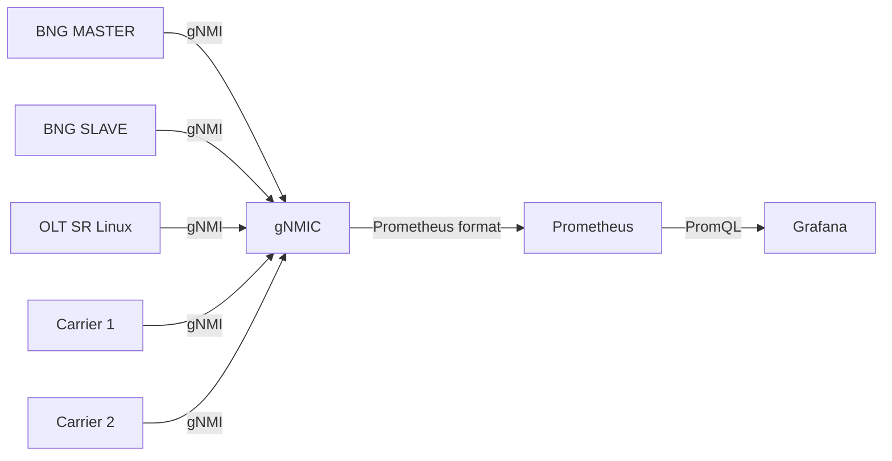

# Stack de Telemetría

## Descripción

El laboratorio incluye un stack completo de métricas y visualización basado en gNMIC → Prometheus → Grafana para monitoreo en tiempo real de los equipos Nokia.

## Arquitectura

## Acceso

| Servicio | URL | Credenciales |
|----------|-----|--------------|
| Grafana | http://localhost:3030 | admin/admin |
| Prometheus | http://localhost:9090 | N/A |

## Dashboards Incluidos

- **SROS Dashboard**: Métricas de los BNGs Nokia (interfaces, sesiones, NAT)
- **Small ISP SR Linux Edge**: Métricas de OLT, Carrier 1 y Carrier 2
- **Nokia Syslog Overview**: Visualización de logs centralizados con Alloy + Loki dentro de Grafana
