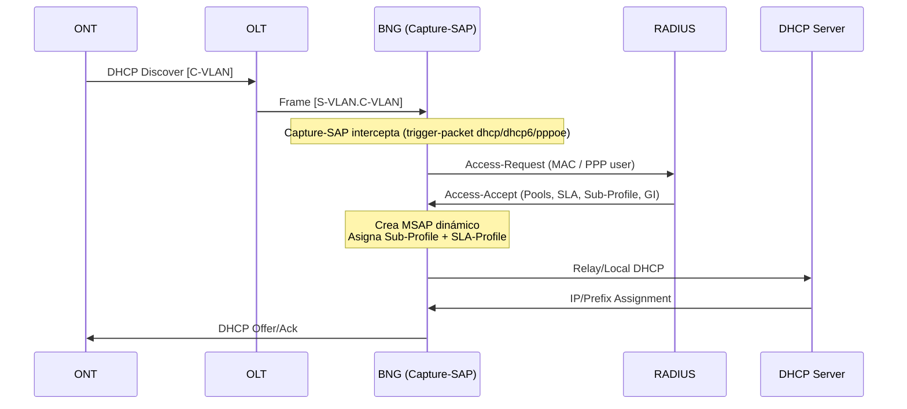

# Flujo de Autenticación

## Descripción General

El flujo de autenticación implementa el modelo **ESM (Enhanced Subscriber Management)** de Nokia SROS con autenticación RADIUS y fallback a Local User Database (LUDB). El laboratorio soporta tanto IPoE como PPPoE con tres perfiles de servicio diferenciados.

## Perfiles de Servicio

| Perfil | S-VLAN | C-VLAN | Group Interface | IP Stack | NAT |
|--------|--------|--------|-----------------|----------|-----|
| IPv6-only | 50 | 150 | ipv6-only | WAN IPv6 + PD | NAT64 |
| Dual-Stack | 51 | 200 | dual-stack | IPv4 + WAN IPv6 + PD | CGNAT Det. |
| VIP | 52 | 300 | vip | IPv4 only | One-to-One |

## Diagrama de Secuencia



## Atributos RADIUS

### Access-Request

| Atributo | Valor Ejemplo |
|----------|---------------|
| User-Name | 00:d0:f6:01:01:01 (IPoE) o test@test.com (PPPoE) |
| User-Password | testlab123 |
| NAS-IP-Address | 10.99.1.2 |
| Calling-Station-Id | MAC del cliente |

### Access-Accept (Ejemplo ONT1 WAN1 - IPv6-only)

```text
00:d0:f6:01:01:01   Cleartext-Password := "testlab123"
                    Framed-IPv6-Pool = "IPv6",
                    Alc-Delegated-IPv6-Pool = "IPv6",
                    Alc-SLA-Prof-str = "100M",
                    Alc-Subsc-Prof-str = "subprofile",
                    Alc-Subsc-ID-Str = "ONT-001",
                    Alc-MSAP-Interface= "ipv6-only",
                    Fall-Through = Yes
```

## Fallback a LUDB

Si el servidor RADIUS no está disponible, la autenticación cae al Local User Database:

```text
/configure subscriber-mgmt radius-authentication-policy "autpolicy" fallback action user-db "clientes"
```

Para probarlo:

```bash
docker stop radius
```

Los suscriptores configurados en la LUDB continuarán autenticándose normalmente.

## Pools DHCP

### IPv6-only

| Pool | Prefijo | Tipo | VPRN |
|------|---------|------|------|
| IPv6 (WAN) | `2001:db8:100::/56` | wan-host | 9998 |
| IPv6 (PD) | 2001:db8:200::/48 | pd (min /56, max /64) | 9998 |

### Dual-Stack

| Pool | Prefijo/Subnet | Tipo | VPRN |
|------|----------------|------|------|
| cgnat | 100.80.0.0/29 | DHCPv4 | 9998 |
| IPv6-dual-stack (WAN) | 2001:db8:cccc::/56 | wan-host | 9998 |
| IPv6-dual-stack (PD) | 2001:db8:dddd::/48 | pd | 9998 |

### VIP

| Pool | Subnet | Tipo | VPRN |
|------|--------|------|------|
| one-to-one | 192.168.5.0/29 | DHCPv4 | 9998 |
