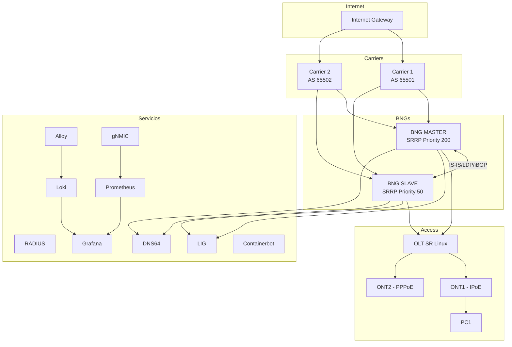

# Topología de Red

## Visión General

Este laboratorio implementa una arquitectura de **Small ISP** con redundancia activo/backup entre dos BNG Nokia 7750 SR-7, conectividad upstream dual-carrier vía BGP, y acceso a suscriptores mediante una OLT SR Linux con tres tipos de servicio diferenciados.

## Arquitectura del ISP

La topología se compone de tres capas principales:

:::tip[Capas de la Arquitectura]

- **Carriers**: Dos routers SR Linux (Carrier 1 AS 65501, Carrier 2 AS 65502) que proveen conectividad a Internet con local-preference diferenciada (C1=300, C2=150)
- **All in One Solution**: Dos BNG Nokia 7750 SR-7 (MASTER/SLAVE) con SRRP, EHS, NAT, ESM y Lawful Interception, más el stack de servicios (Grafana, Prometheus, Loki, Alloy, gNMIC, RADIUS, LIG, DNS64, Containerbot)
- **Access**: OLT SR Linux conectada a ONTs con tres perfiles de servicio via MAC-VRF

:::
## Containerlab Topology

El laboratorio se define en el archivo `lab.yml`:

```yaml
name: small-isp
prefix: ""

mgmt:
  network: small-isp
  ipv4-subnet: 10.99.1.0/24
  ipv6-subnet: fd00:cafe::/64

topology:
  nodes:
    # =========================================================================
    # Carrier1
    # =========================================================================
    carrier1:
      kind: nokia_srlinux
      image: ghcr.io/nokia/srlinux:25.10
      mgmt-ipv4: 10.99.1.252
      startup-config: configs/srlinux/carrier1.txt
      binds:
        - configs/environment/srlinux.rc:/home/admin/.srlinuxrc:rw
      ports:
        - 56610:22

    # =========================================================================
    # Carrier2
    # =========================================================================
    carrier2:
      kind: nokia_srlinux
      image: ghcr.io/nokia/srlinux:25.10
      mgmt-ipv4: 10.99.1.253
      startup-config: configs/srlinux/carrier2.txt
      binds:
        - configs/environment/srlinux.rc:/home/admin/.srlinuxrc:rw
      ports:
        - 56611:22

    # =========================================================================
    # BNG MASTER
    # =========================================================================
    bngmaster:
      kind: nokia_srsim
      image: localhost/nokia/srsim:25.10.R2
      mgmt-ipv4: 10.99.1.2
      license: configs/license/SR_SIM_license.txt
      type: sr-7
      components:
        - slot: A
        - slot: B
        - slot: 1
          type: iom5-e
          env:
            NOKIA_SROS_MDA_1: me6-100gb-qsfp28
            NOKIA_SROS_SFM: m-sfm6-7/12
        - slot: 2
          type: iom4-e-b
          env:
            NOKIA_SROS_MDA_1: isa2-bb
            NOKIA_SROS_SFM: m-sfm6-7/12
      startup-config: configs/sros/master.txt
      binds:
        - configs/sros/master-scripts:/home/sros/flash3/scripts:rw
      ports:
        - 56612:22

    # =========================================================================
    # BNG SLAVE
    # =========================================================================
    bngslave:
      kind: nokia_srsim
      image: localhost/nokia/srsim:25.10.R2
      mgmt-ipv4: 10.99.1.3
      license: configs/license/SR_SIM_license.txt
      type: sr-7
      components:
        - slot: A
        - slot: B
        - slot: 1
          type: iom5-e
          env:
            NOKIA_SROS_MDA_1: me6-100gb-qsfp28
            NOKIA_SROS_SFM: m-sfm6-7/12
        - slot: 2
          type: iom4-e-b
          env:
            NOKIA_SROS_MDA_1: isa2-bb
            NOKIA_SROS_SFM: m-sfm6-7/12
      startup-config: configs/sros/slave.txt
      binds:
        - configs/sros/slave-scripts:/home/sros/flash3/scripts:rw
      ports:
        - 56613:22

    # =========================================================================
    # OLT
    # =========================================================================
    olt:
      kind: nokia_srlinux
      image: ghcr.io/nokia/srlinux:25.10
      mgmt-ipv4: 10.99.1.4
      startup-config: configs/srlinux/olt.txt
      ports:
        - 56614:22
      binds:
        - configs/environment/srlinux.rc:/home/admin/.srlinuxrc:rw

    # =========================================================================
    # ONT1
    # =========================================================================
    ont1:
      kind: linux
      mgmt-ipv4: 10.99.1.5
      image: ghcr.io/abelperezr/ont-ds:0.3
      env:
        CONNECTION_TYPE: ipoe
        IFPHY: eth1
        VLAN_ID: "150"
        IFLAN: eth2
        MAC_ADDRESS: 00:D0:F6:01:01:01
        WAN1_MODE: ipv6
        WAN1_DHCP_PERSIST: "true"
        IFPHY2: eth3
        VLAN_ID2: "200"
        MAC_ADDRESS2: 00:D0:F6:01:01:02
        WAN2_MODE: dual
        WAN2_DHCP_PERSIST: "true"
        IFPHY3: eth4
        VLAN_ID3: "300"
        MAC_ADDRESS3: 00:D0:F6:01:01:03
        WAN3_MODE: ipv4
        WAN3_DHCP_PERSIST: "true"
        USER_PASSWORD: test
        DISABLE_MGMT_IPV6: "true"
      ports:
        - 8090:8080

    # =========================================================================
    # ONT2 
    # =========================================================================
    ont2:
      kind: linux
      mgmt-ipv4: 10.99.1.6
      image: ghcr.io/abelperezr/ont-ds:0.3
      env:
        CONNECTION_TYPE: pppoe
        WAN1_MODE: ipv6
        PPP_USER: test@test.com
        PPP_PASS: testlab123
        VLAN_ID: "150"
        IFPHY: eth1
        MAC_ADDRESS: 00:D0:F6:01:01:04
        USER_PASSWORD: test
        DISABLE_MGMT_IPV6: "true"
      ports:
        - 8091:8080

    # =========================================================================
    # PC1 
    # =========================================================================
    pc1:
      kind: linux
      group: leaf
      mgmt-ipv4: 10.99.1.7
      image: ghcr.io/srl-labs/network-multitool
      ports:
        - 56616:22
      exec:
        - bash -lc "ip link set dev eth1 up || true"
        - bash -lc "sysctl -w net.ipv6.conf.all.forwarding=0 || true"
        - bash -lc "sysctl -w net.ipv6.conf.eth1.accept_ra=2 || true"
        - bash -lc "sysctl -w net.ipv6.conf.eth1.autoconf=1 || true"
        - bash -lc "ip -6 route del default via fd00:cafe::1 dev eth0 || true"

    # =========================================================================
    # RADIUS
    # =========================================================================
    radius:
      kind: linux
      group: server
      mgmt-ipv4: 10.99.1.8
      image: ghcr.io/abelperezr/freeradius-custom:0.1
      binds:
        - configs/radius/clients.tmpl.conf:/etc/freeradius/clients.conf
        - configs/radius/authorize:/etc/freeradius/mods-config/files/authorize
      ports:
        - 56617:22

    # =========================================================================
    # GNMIC
    # =========================================================================        
    gnmic:
      kind: linux
      group: server
      mgmt-ipv4: 10.99.1.9
      image: ghcr.io/openconfig/gnmic:latest
      binds:
        - configs/gnmic/config.yml:/gnmic-config.yml:ro
        - /var/run/docker.sock:/var/run/docker.sock:ro
      cmd: --config /gnmic-config.yml --log subscribe
      ports:
        - 56618:22

    # =========================================================================
    # PROMETHEUS
    # =========================================================================   
    prometheus:
      kind: linux
      group: server
      mgmt-ipv4: 10.99.1.10
      image: prom/prometheus
      binds:
        - configs/prometheus/prometheus.yml:/etc/prometheus/prometheus.yml:ro
      ports:
        - 9090:9090
      cmd: --config.file=/etc/prometheus/prometheus.yml

    # =========================================================================
    # GRAFANA
    # ========================================================================= 
    grafana:
      kind: linux
      group: server
      mgmt-ipv4: 10.99.1.11
      image: grafana/grafana:10.3.5
      binds:
        - configs/grafana/datasource.yml:/etc/grafana/provisioning/datasources/datasource.yaml:ro
        - configs/grafana/dashboards.yml:/etc/grafana/provisioning/dashboards/dashboards.yaml:ro
        - configs/grafana/dashboards:/var/lib/grafana/dashboards
      ports:
        - 3030:3000
      env:
        GF_ORG_ROLE: Editor
        GF_ORG_NAME: Main Org.
        GF_AUTH_ANONYMOUS_ENABLED: "true"
        GF_AUTH_ANONYMOUS: "true"
        GF_SECURITY_ADMIN_PASSWORD: admin
      cmd: sh -c grafana cli admin reset-admin-password ${GF_SECURITY_ADMIN_PASSWORD}
        && /run.sh

    # =========================================================================
    # LIG - Lawful Interception Gateway + LEA Console
    # =========================================================================
    lig:
      kind: linux
      mgmt-ipv4: 10.99.1.12
      image: ghcr.io/srl-labs/network-multitool
      ports:
        - 56619:22
        - 8092:8080
      binds:
        - configs/lig/lig.py:/config/lig.py:ro
        - configs/lig/index.html:/config/index.html:ro
        - configs/lig/start.sh:/config/start.sh:ro
      exec:
        - bash -c "ip link set eth1 up || true"
        - bash -c "ip addr flush dev eth1 || true"
        - bash -c "ip addr add 172.19.1.1/30 dev eth1 || true"
        - bash -c "ip -6 addr add 2001:db8:ffff::1/126 dev eth1 || true"
        - bash -c "ip link set eth2 up || true"
        - bash -c "ip addr flush dev eth2 || true"
        - bash -c "ip addr add 172.20.1.1/30 dev eth2 || true"
        - bash -c "ip -6 addr add 2001:db8:fffe::1/126 dev eth2 || true"
        - bash -c "mkdir -p /app && cp /config/lig.py /app/ && cp
          /config/index.html /app/"
        - bash -c "nohup python3 /app/lig.py > /var/log/lig.log 2>&1 &"

    # =========================================================================
    # LOKI
    # =========================================================================
    loki:
      kind: linux
      group: server
      mgmt-ipv4: 10.99.1.15
      image: grafana/loki:latest
      binds:
        - configs/logs/loki-config.yml:/etc/loki/config.yml:ro
      ports:
        - 3101:3100
      cmd: -config.file=/etc/loki/config.yml

    # =========================================================================
    # ALLOY
    # =========================================================================
    alloy:
      kind: linux
      group: server
      mgmt-ipv4: 10.99.1.16
      image: grafana/alloy:latest
      binds:
        - configs/logs/config.alloy:/etc/alloy/config.alloy:ro
      ports:
        - 12345:12345
        - 1514:1514/udp
        - 5514:5514/udp
      cmd: run /etc/alloy/config.alloy --storage.path=/var/lib/alloy/data
        --server.http.listen-addr=0.0.0.0:12345

    # =========================================================================
    # INTERNET
    # =========================================================================
    internet:
      kind: linux
      group: server
      mgmt-ipv4: 10.99.1.14
      image: ghcr.io/srl-labs/network-multitool
      ports:
        - 56620:22
      exec:
        - bash -c "ip link set eth1 up || true"
        - bash -c "ip addr add 10.99.100.2/30 dev eth1 || true"
        - bash -c "ip -6 addr add fd00:a1::2/126 dev eth1 || true"
        - bash -c "ip link set eth2 up || true"
        - bash -c "ip addr add 10.99.200.2/30 dev eth2 || true"
        - bash -c "ip -6 addr add fd00:a2::2/126 dev eth2 || true"
        - sh -c "sysctl -w net.ipv4.ip_forward=1"
        - sh -c "sysctl -w net.ipv4.conf.all.rp_filter=0"
        - sh -c "sysctl -w net.ipv4.conf.eth0.rp_filter=0"
        - sh -c "sysctl -w net.ipv4.conf.eth1.rp_filter=0"
        - sh -c "sysctl -w net.ipv4.conf.eth2.rp_filter=0"
        - sh -c "sysctl -w net.ipv6.conf.all.forwarding=1"
        - sh -c "iptables -t nat -F || true; iptables -F || true"
        - sh -c "iptables -P FORWARD ACCEPT || true"
        - sh -c "iptables -t nat -A POSTROUTING -o eth0 -j MASQUERADE"
        - sh -c "iptables -A FORWARD -i eth1 -o eth0 -j ACCEPT"
        - sh -c "iptables -A FORWARD -i eth2 -o eth0 -j ACCEPT"
        - sh -c "iptables -A FORWARD -i eth0 -o eth1 -m conntrack --ctstate
          ESTABLISHED,RELATED -j ACCEPT"
        - sh -c "iptables -A FORWARD -i eth0 -o eth2 -m conntrack --ctstate
          ESTABLISHED,RELATED -j ACCEPT"
        - sh -c "ip6tables -t nat -F || true; ip6tables -F || true"
        - sh -c "ip6tables -P FORWARD ACCEPT || true"
        - sh -c "ip6tables -t nat -A POSTROUTING -o eth0 -j MASQUERADE || true"
        - sh -c "ip6tables -A FORWARD -i eth1 -o eth0 -j ACCEPT || true"
        - sh -c "ip6tables -A FORWARD -i eth2 -o eth0 -j ACCEPT || true"
        - sh -c "ip6tables -A FORWARD -i eth0 -o eth1 -m conntrack --ctstate
          ESTABLISHED,RELATED -j ACCEPT || true"
        - sh -c "ip6tables -A FORWARD -i eth0 -o eth2 -m conntrack --ctstate
          ESTABLISHED,RELATED -j ACCEPT || true"
        - bash -c "ip route add 99.99.99.99/32 via 10.99.100.1 dev eth1 || true"
        - bash -c "ip route add 88.88.88.88/29 via 10.99.100.1 dev eth1 || true"
        - bash -c "ip route add 199.199.199.199/32 via 10.99.100.1 dev eth1 ||
          true"
        - bash -c "ip route add 172.16.1.0/31 via 10.99.100.1 dev eth1 || true"
        - bash -c "ip route add 172.16.1.2/31 via 10.99.100.1 dev eth1 || true"
        - bash -c "ip route add 172.16.2.0/31 via 10.99.200.1 dev eth2 || true"
        - bash -c "ip route add 172.16.2.2/31 via 10.99.200.1 dev eth2 || true"
        - bash -c "ip -6 route add 2001:db8:100::/56 via fd00:a1::1 dev eth1 ||
          true"
        - bash -c "ip -6 route add 2001:db8:200::/48 via fd00:a1::1 dev eth1 ||
          true"
        - bash -c "ip -6 route add 2001:db8:cccc::/56 via fd00:a2::1 dev eth2 ||
          true"
        - bash -c "ip -6 route add 2001:db8:dddd::/48 via fd00:a2::1 dev eth2 ||
          true"

    # =========================================================================
    # DNS64
    # =========================================================================
    dns:
      kind: linux
      mgmt-ipv4: 10.99.1.13
      image: ghcr.io/srl-labs/network-multitool:latest
      exec:
        - bash -lc "apk add --no-cache bind bind-tools"
        - bash -lc "mkdir -p /var/cache/bind /var/log/bind && chown -R
          named:named /var/cache/bind /var/log/bind"
        - bash -lc "ip -6 addr add 2001:db8:aaaa::2/126 dev eth1"
        - bash -lc "ip -6 addr add 2001:db8:aaab::2/126 dev eth2"
        - bash -lc "ip -6 route replace 2001:db8:100::/56 via 2001:db8:aaaa::1
          dev eth1"
        - bash -lc "ip -6 route replace 2001:db8:200::/48 via 2001:db8:aaaa::1
          dev eth1"
        - bash -lc "ip -6 route replace 2001:db8:cccc::/56 via 2001:db8:aaab::1
          dev eth2"
        - bash -lc "ip -6 route replace 2001:db8:dddd::/48 via 2001:db8:aaab::1
          dev eth2"
        - bash -lc "ip -6 route replace default via 2001:db8:aaaa::1 dev eth1"
        - bash -lc "named-checkconf /etc/bind/named.conf"
        - bash -lc "named -c /etc/bind/named.conf -u named"
      ports:
        - 56621:22
      binds:
        - configs/dns64/named.conf:/etc/bind/named.conf:ro

    # =========================================================================
    # CONTAINERBOT
    # =========================================================================
    containerbot:
      kind: linux
      group: server
      mgmt-ipv4: 10.99.1.200
      image: ghcr.io/abelperezr/containerbot:0.0.1
      ports:
        - 56622:22
      binds:
        - configs/cbot/secrets.env:/app/secrets.env
        - configs/cbot/scripts:/app/scripts
        - configs/cbot/ansible:/app/ansible
        - configs/cbot/config.yaml:/app/config.yaml
    # =========================================================================
    # CONEXIONES
    # =========================================================================
  links:
    # CARRIERS TO INTERNET
    - endpoints: [ "carrier1:ethernet-1/3", "internet:eth1" ]
    - endpoints: [ "carrier2:ethernet-1/3", "internet:eth2" ]
    # BNGS TO CARRIER1
    - endpoints: [ "bngmaster:1/1/c5/1", "carrier1:ethernet-1/1" ]
    - endpoints: [ "bngslave:1/1/c5/1", "carrier1:ethernet-1/2" ]
    # BNGS TO CARRIER2
    - endpoints: [ "bngmaster:1/1/c6/1", "carrier2:ethernet-1/1" ]
    - endpoints: [ "bngslave:1/1/c6/1", "carrier2:ethernet-1/2" ]
    # BNGS
    - endpoints: [ "bngmaster:1/1/c1/1", "bngslave:1/1/c1/1" ]
    # BNGS TO OLT
    - endpoints: [ "bngmaster:1/1/c2/1", "olt:ethernet-1/1" ]
    - endpoints: [ "bngslave:1/1/c2/1", "olt:ethernet-1/2" ]
    # BNGS TO LIG 
    - endpoints: [ "bngmaster:1/1/c3/1", "lig:eth1" ]
    - endpoints: [ "bngslave:1/1/c3/1", "lig:eth2" ]
    # BNGS TO DNS
    - endpoints: [ "bngmaster:1/1/c4/1", "dns:eth1" ]
    - endpoints: [ "bngslave:1/1/c4/1", "dns:eth2" ]
    # OLT TO ONT1
    - endpoints: [ "olt:ethernet-1/3", "ont1:eth1" ]
    - endpoints: [ "olt:ethernet-1/4", "ont1:eth3" ]
    - endpoints: [ "olt:ethernet-1/5", "ont1:eth4" ]
    # OLT TO ONT2
    - endpoints: [ "olt:ethernet-1/6", "ont2:eth1" ]
    # ONT TO PC
    - endpoints: [ "ont1:eth2", "pc1:eth1" ]

```
## Conexiones Físicas



## Tabla de Enlaces

| Origen | Puerto | Destino | Puerto | Función |
|--------|--------|---------|--------|---------|
| Carrier 1 | ethernet-1/1 | BNG MASTER | 1/1/c5/1 | eBGP IPv4/IPv6 |
| Carrier 1 | ethernet-1/2 | BNG SLAVE | 1/1/c5/1 | eBGP IPv4/IPv6 |
| Carrier 1 | ethernet-1/3 | Internet | eth1 | Upstream |
| Carrier 2 | ethernet-1/1 | BNG MASTER | 1/1/c6/1 | eBGP IPv4/IPv6 |
| Carrier 2 | ethernet-1/2 | BNG SLAVE | 1/1/c6/1 | eBGP IPv4/IPv6 |
| Carrier 2 | ethernet-1/3 | Internet | eth2 | Upstream |
| BNG MASTER | 1/1/c1/1 | BNG SLAVE | 1/1/c1/1 | IS-IS/LDP/iBGP + trigger SRRP por policy |
| BNG MASTER | 1/1/c2/1 | OLT | ethernet-1/1 | Acceso (QinQ) + SRRP message-path |
| BNG SLAVE | 1/1/c2/1 | OLT | ethernet-1/2 | Acceso (QinQ) + SRRP message-path |
| BNG MASTER | 1/1/c3/1 | LIG | eth1 | Lawful Interception |
| BNG SLAVE | 1/1/c3/1 | LIG | eth2 | Lawful Interception |
| BNG MASTER | 1/1/c4/1 | DNS64 | eth1 | DNS64 |
| BNG SLAVE | 1/1/c4/1 | DNS64 | eth2 | DNS64 |
| OLT | ethernet-1/3 | ONT1 | eth1 | WAN1 (VLAN 150) |
| OLT | ethernet-1/4 | ONT1 | eth3 | WAN2 (VLAN 200) |
| OLT | ethernet-1/5 | ONT1 | eth4 | WAN3 (VLAN 300) |
| OLT | ethernet-1/6 | ONT2 | eth1 | WAN1 PPPoE (VLAN 150) |
| ONT1 | eth2 | PC1 | eth1 | LAN (Prefix Delegation) |

## Direccionamiento de Gestión

| Dispositivo | IP de Gestión | Puerto SSH |
|-------------|---------------|------------|
| BNG MASTER | 10.99.1.2 | 56612 |
| BNG SLAVE | 10.99.1.3 | 56613 |
| OLT | 10.99.1.4 | 56614 |
| ONT1 | 10.99.1.5 | - |
| ONT2 | 10.99.1.6 | - |
| PC1 | 10.99.1.7 | - |
| RADIUS | 10.99.1.8 | 56617 |
| gNMIC | 10.99.1.9 | 56618 |
| Prometheus | 10.99.1.10 | 9090 |
| Grafana | 10.99.1.11 | 3030 |
| Loki | 10.99.1.15 | 3101 |
| Alloy | 10.99.1.16 | 12345 |
| LIG | 10.99.1.12 | 56619 |
| DNS64 | 10.99.1.13 | 56621 |
| Internet | 10.99.1.14 | 56620 |
| Containerbot | 10.99.1.200 | 56622 |
| Carrier 1 | 10.99.1.252 | 56610 |
| Carrier 2 | 10.99.1.253 | 56611 |
