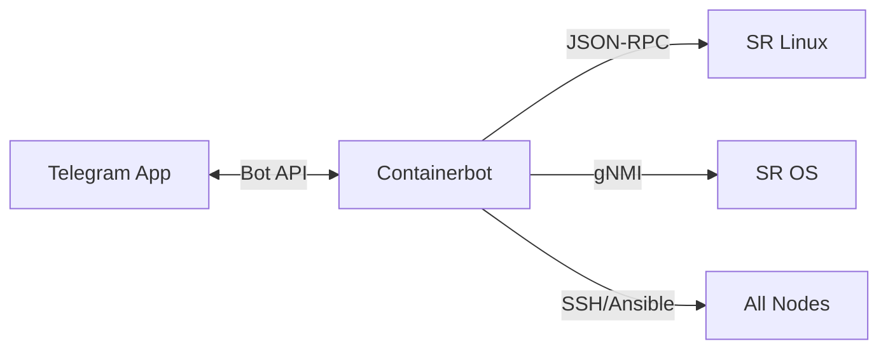

# containerbot

## Description

**Containerbot** is a Telegram bot designed to execute operation scripts and tests against laboratory equipment. It allows you to control the laboratory remotely from a Telegram chat, executing shell and Python scripts that interact with Nokia devices via JSON-RPC and gNMI.

## Features

- **Script auto-discovery**: Automatically scans the `scripts/` directory and generates run buttons
- **Categorization**: Scripts are organized into categories (Link Failures, Verification, General)
- **Confirmation**: Some scripts require confirmation before running
- **Arguments**: Some scripts accept dynamic arguments
- **Ansible Playbooks**: Support for running Ansible playbooks
- **Timeouts**: Timeout configurable by script (default: 120s)
- **Message Limits**: Truncate long output to not exceed the Telegram limit

## Architecture

