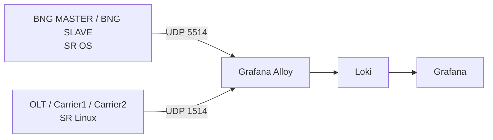

# LOGs

The **LOGs** section documents the lab syslog integration and the Grafana dashboard used to centralize Nokia events.

## Goal

This integration was designed to cover three needs in the lab:

1. Centralize `SR OS` and `SR Linux` events in one pipeline.
2. Filter quickly by platform, node, application, and event type.
3. Reuse the existing `Grafana` stack instead of adding a separate logging UI.

## Components

| Component | Function |
|----------|----------|
| `Loki` | Stores and indexes logs |
| `Alloy` | Receives syslog, normalizes labels, and forwards to Loki |
| `Grafana` | Visualizes logs and exposes the dashboard |

## What this module documents

In this section you will find:

- the complete log pipeline architecture
- a block-by-block explanation of `configs/logs/config.alloy`
- a block-by-block explanation of `configs/logs/loki-config.yml`
- the syslog configuration applied on `SR OS` and `SR Linux`
- the retention impact and how default ephemeral storage works
- useful queries and operational validation steps

## Access

| Service | URL | Credentials |
|---------|-----|-------------|
| Grafana | `http://localhost:3030` | `admin/admin` |
| Loki API | `http://localhost:3101` | N/A |
| Alloy UI | `http://localhost:12345` | N/A |

## General flow

## What the dashboard includes

The `Nokia Syslog Overview` dashboard is organized to operate both platforms from a single view:

- global counters for lines and streams
- separate metrics for `SR OS` and `SR Linux`
- dedicated filters for each platform
- `Raw Syslog - SR OS` panel
- `Raw Syslog - SR Linux` panel

## Configuration applied on the nodes

### SR OS

- sends syslog over `UDP/5514`
- uses `facility local6`
- uses `severity info`
- publishes the system name with `hostname use-system-name`

### SR Linux

- sends syslog over `UDP/1514`
- uses `facility local6`
- uses `match-above informational`
- publishes logs through the `mgmt` network-instance

In addition, `grpc-server eda-mgmt` was disabled on SR Linux nodes because it referenced a non-existent `tls-profile "EDA"` and generated continuous syslog noise.

## Next page

The full technical logic, Loki labels, `Alloy` and `Loki` internals, queries, and platform-specific configuration details are documented in [Dashboard and Integration](./dashboard).
