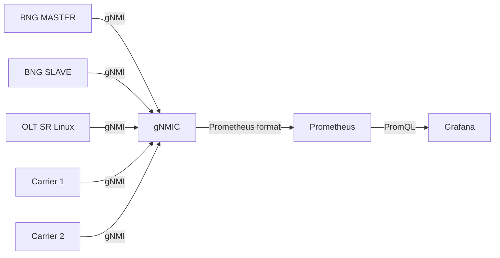

# Telemetry Stack

## Description

The lab includes a complete metrics and visualization stack based on gNMIC → Prometheus → Grafana for real-time monitoring of Nokia devices.

## Architecture

## Access

| Service | URL | Credentials |
|----------|-----|--------------|
| Grafana | http://localhost:3030 | admin/admin |
| Prometheus | http://localhost:9090 | N/A |

## Dashboards Included

- **SROS Dashboard**: Nokia BNGs metrics (interfaces, sessions, NAT)
- **Small ISP SR Linux Edge**: Metrics for OLT, Carrier 1, and Carrier 2
- **Nokia Syslog Overview**: Centralized logs visualized in Grafana through Alloy + Loki
