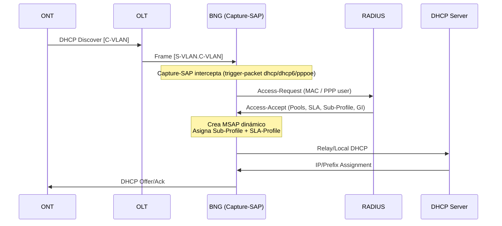

# Authentication Flow

## General Description

The authentication flow implements the **ESM (Enhanced Subscriber Management)** model of Nokia SROS with RADIUS authentication and fallback to the Local User Database (LUDB). The laboratory supports both IPoE and PPPoE with three different service profiles.

## Service Profiles

| Profile | S-VLAN | C-VLAN | Group Interface | IP Stack | NAT |
|--------|--------|--------|-----------------|----------|-----|
| IPv6-only | 50 | 150 | ipv6-only | IPv6 WAN + PD | NAT64 |
| Dual-Stack | 51 | 200 | dual-stack | IPv4 + WAN IPv6 + PD | CGNAT Det. |
| VIP | 52 | 300 | vip | IPv4 only | One-to-One |

## Sequence Diagram



## RADIUS attributes

### Access-Request

| Attribute | Value Example |
|----------|---------------|
| User-Name | 00:d0:f6:01:01:01 (IPoE) or test@test.com (PPPoE) |
| User-Password | testlab123 |
| NAS-IP-Address | 10.99.1.2 |
| Calling-Station-Id | Client MAC |

### Access-Accept (Example ONT1 WAN1 - IPv6-only)

```text
00:d0:f6:01:01:01   Cleartext-Password := "testlab123"
                    Framed-IPv6-Pool = "IPv6",
                    Alc-Delegated-IPv6-Pool = "IPv6",
                    Alc-SLA-Prof-str = "100M",
                    Alc-Subsc-Prof-str = "subprofile",
                    Alc-Subsc-ID-Str = "ONT-001",
                    Alc-MSAP-Interface= "ipv6-only",
                    Fall-Through = Yes
```

## Fallback to LUDB

If the RADIUS server is not available, authentication falls to the Local User Database:

```text
/configure subscriber-mgmt radius-authentication-policy "autpolicy" fallback action user-db "clientes"
```

To test it:

```bash
docker stop radius
```

Subscribers configured in the LUDB will continue to authenticate normally.

## DHCP Pools

### IPv6-only

| Pool | Prefix | Type | VPRN |
|------|--------|------|------|
| IPv6 (WAN) | 2001:db8:100::/56 | wan-host | 9998 |
| IPv6 (PD) | 2001:db8:200::/48 | pd (min /56, max /64) | 9998 |

### Dual-Stack

| Pool | Prefix/Subnet | Type | VPRN |
|------|---------------|------|------|
| cgnat | 100.80.0.0/29 | DHCPv4 | 9998 |
| IPv6-dual-stack (WAN) | 2001:db8:cccc::/56 | wan-host | 9998 |
| IPv6-dual-stack (PD) | 2001:db8:dddd::/48 | pd | 9998 |

### VIP

| Pool | Subnet | Type | VPRN |
|------|--------|------|------|
| one-to-one | 192.168.5.0/29 | DHCPv4 | 9998 |
