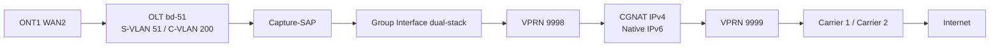
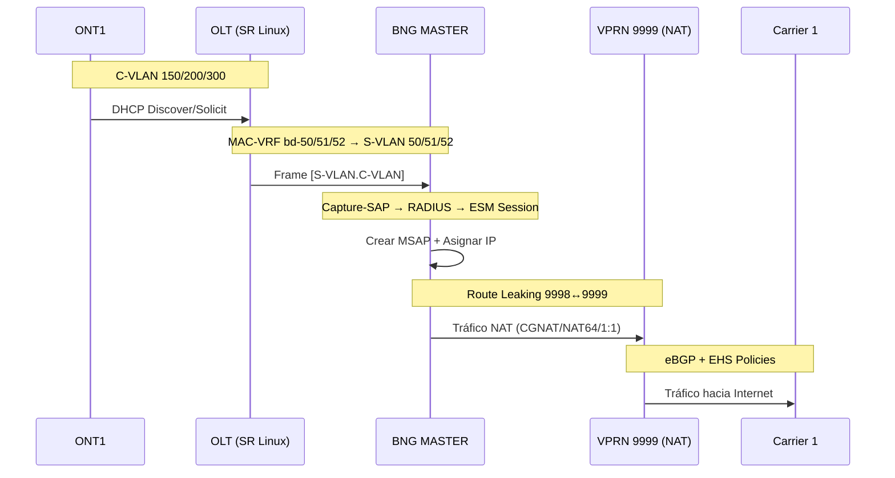

# Overlay Network

## Logical Services Diagram


## Description of the Services Layer

The **Overlay** represents the VPRN and VPLS logical services that operate over the MPLS underlay. The architecture uses two VPRNs (9998 for subscribers and 9999 for Internet/NAT) with bidirectional route-leaking via VPN-IPv4 communities.

## VPRNs

### VPRN 9998 - VRF Subscriber

Contains all subscriber infrastructure:

- Subscriber Interface "services" with three Group Interfaces
- DHCP Servers (IPv4 + IPv6)
- NAT Inside (CGNAT, NAT64, One-to-One)
- SRRP Instances
- Redundant Interface via SDP

### VPRN 9999 - Internet VRF

Contains upstream connectivity:

- Interfaces to Carrier 1 and Carrier 2
- Interface to LIG
- NAT Outside Pools (dtpool, nat64-pool, one-to-one)
- eBGP with Carriers

## VLANs and MAC-VRFs scheme

The SR Linux OLT uses MAC-VRFs to bridging between the BNGs and the ONTs:

| MAC-VRF | S-VLAN | C-VLAN | Service | Group Interface |
|---------|--------|--------|---------|-----------------|
| bd-50 | 50 | 150 | IPv6-only | ipv6-only |
| bd-51 | 51 | 200 | Dual-Stack | dual-stack |
| bd-52 | 52 | 300 | VIP (IPv4 1:1) | vip |
| bd-srrp | 4094 | None | SRRP Messages | None |

:::info[Three Service Profiles]

- **S-VLAN 50 / C-VLAN 150**: IPv6-only service with NAT64 (ipv6-only GI)
- **S-VLAN 51 / C-VLAN 200**: Dual-Stack service with deterministic CGNAT (dual-stack GI)
- **S-VLAN 52 / C-VLAN 300**: VIP Service with One-to-One NAT (vip GI)

:::

## Service Chaining by Flow

This view summarizes the logical end-to-end path for each service. It is useful for demos, training, and troubleshooting because it ties together access, policy, VPRN/NAT, and upstream forwarding in a single table.

| Service | Encapsulation / Ingress | BNG Processing | Egress | Related ATP |
|---------|--------------------------|----------------|--------|-------------|
| ONT1 WAN1 IPv6-only | `ONT1 -> OLT bd-50 -> S-VLAN 50 / C-VLAN 150` | `Capture-SAP -> GI ipv6-only -> VPRN 9998 -> route-leaking with VPRN 9999 -> NAT64/DNS64 when applicable` | `Carrier 1 / Carrier 2 -> Internet` | [NAT64](../atp/nat64.md) |
| ONT1 WAN2 Dual-Stack | `ONT1 -> OLT bd-51 -> S-VLAN 51 / C-VLAN 200` | `Capture-SAP -> GI dual-stack -> VPRN 9998 -> CGNAT for IPv4 + native IPv6 -> VPRN 9999` | `Carrier 1 / Carrier 2 -> Internet` | [Observability](../atp/observability.md) |
| ONT1 WAN3 VIP | `ONT1 -> OLT bd-52 -> S-VLAN 52 / C-VLAN 300` | `Capture-SAP -> GI vip -> VPRN 9998 -> One-to-One NAT -> VPRN 9999` | `Carrier 1 / Carrier 2 -> Internet` | [CGNAT / NAT policies](../atp/cgnat.md) |
| ONT2 WAN1 PPPoE | `ONT2 -> OLT bd-50 -> S-VLAN 50 / C-VLAN 150` | `PPPoE + RADIUS -> GI ipv6-only -> VPRN 9998 -> NAT64 when applicable -> VPRN 9999` | `Carrier 1 / Carrier 2 -> Internet` | [ESM](../atp/esm.md) |

## Service Flow Diagrams

### ONT1 WAN2 Dual-Stack



### ONT2 WAN1 PPPoE

```mermaid
flowchart LR
    ONT2[ONT2 WAN1 PPPoE] --> OLT50[OLT bd-50<br/>S-VLAN 50 / C-VLAN 150]
    OLT50 --> PPP[PPPoE Discovery / Session]
    PPP --> AAA[RADIUS<br/>or LUDB fallback]
    AAA --> GI6[Group Interface ipv6-only]
    GI6 --> VPRN8[VPRN 9998]
    VPRN8 --> NAT64[NAT64 / DNS64]
    NAT64 --> VPRN9[VPRN 9999]
    VPRN9 --> UPSTREAM[Carrier 1 / Carrier 2]
    UPSTREAM --> INTERNET2[Internet]
```



## Route Leaking Inter-VPRN

Routes are exchanged between VPRN 9998 and 9999 using BGP VPN-IPv4 with communities:

```text
# Community para rutas del Internet VRF
/configure policy-options community "internet-vrf" member "target:65510:9999"

# Community para rutas del Subscriber VRF
/configure policy-options community "subscriber-vrf" member "target:65510:9998"
```

## Capture SAP

Each Capture-SAP in VPLS intercepts traffic according to S-VLAN and assigns it to the corresponding Group Interface:

```text
# S-VLAN 50 → GI ipv6-only (SRRP 1)
/configure service vpls "capture-sap" capture-sap 1/1/c2/1:50.*
  msap-defaults group-interface "ipv6-only"
  track-srrp 1

# S-VLAN 51 → GI dual-stack (SRRP 2)
/configure service vpls "capture-sap" capture-sap 1/1/c2/1:51.*
  msap-defaults group-interface "dual-stack"
  track-srrp 2

# S-VLAN 52 → GI vip (SRRP 3)
/configure service vpls "capture-sap" capture-sap 1/1/c2/1:52.*
  msap-defaults group-interface "vip"
  track-srrp 3
```

## Traffic Flow Overlay


